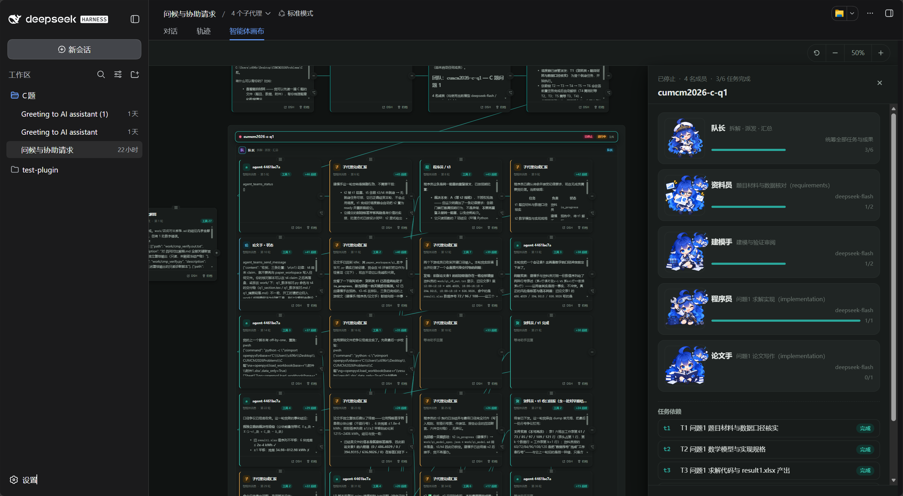

# dsh-flow

**中文** · [English](./README.md)

给 DeepSeek Harness 加一个**统一智能体画布**标签：会话时间轴与多智能体团队层级编排同处一图——用户需求轮在主时间轴，团队作为嵌套区域长在其下，每个成员一个子区域，装着ta的任务与发言卡；成员立绘、按说话者编织的对话链、任务依赖 DAG 一眼可读。



<p align="center">
  <a href="./LICENSE"></a>
  = 22.19.0">
  
  
  
</p>

## 一句话

**需求 → 拉起智能体团队 → 画布自动生成这张图**：对话按说话者分层编排，任务按依赖连线，数据存在 dsh-flow 自己的存储里。

它**完整替代 [dsh-agent-teams](https://github.com/NanmiCoder/dsh-agent-teams)**：13 个工具一一对应，31 项差分守着这条线；但它不依赖对方——装了对方是可选的只读来源，没装照常跑完。用起来有什么不同，见[对照](#与-dsh-agent-teams-的对照)。

## 快速开始

需要支持 profile 插件机制的 DeepSeek Harness、Node.js `>= 22.19.0`，以及 `web` profile。

```sh
dsh plugin --profile web add github:rootkiller6788/dsh-flow
dsh web
```

> 本插件**未发布到 npm**：`dsh-flow` 这个名字在 registry 上属于另一个项目，请不要用 `dsh plugin add dsh-flow`。

启动后，对话区顶部的标签行会多出一个「智能体画布」标签；也可以直接打开 `/dsh-flow/`。

## 画布上有什么

一个页面、一个引擎、一张图。节点分两类：

| 节点 | 画的是什么 | 数据源 |
| --- | --- | --- |
| **会话轮次卡** | 一轮对话（提问 + 回答），按 DSH 原生 fork 关系连成分支树，可追问 / 分支 / 归档；成员中继与子代理通知等**智能体事件轮**以派生标签呈现（`论文手 → 队长`），不暴露协议原文 | 宿主 `sessions` + `workspaces` 服务，投影落盘到 `flow/workspaces.json` |
| **团队层级区域** | 团队标题条下嵌套**成员子区域**：每个成员一格，装着ta的任务 chip（按依赖深度连线）与发言卡（按时间排布）。指派关系由包含表达，依赖用箭头，对话流向由跨区域的轮次链表达 | 团队数据**存放在 dsh-flow 自己的存储**（`<stateDir>/<teamId>/events.jsonl`）；部署里有 `.agent-teams/` 时它作为**只读来源**一并列出 |

### 多智能体对话

点开一张轮次卡，检查器里是**参与者气泡流**：用户消息、成员中继消息（立绘头像 + `发送者 → 接收者` 方向）、子代理通知各自成块，工具调用折叠在过程记录里。

agent-teams（或宿主）会把成员消息以 `Agent <uuid> sent a message:【发送者 → 接收者】正文` 之类的信封中继进宿主会话。本插件在**投影层就把信封拆成结构**（`message.agent`），渲染层对旧数据做同规则兜底——UUID 和协议原文不会出现在画布上。

### 团队检查器

点团队标题条或成员子区域，右栏呈现**整体编排**：成员立绘行（头像 + 角色 + 模型 + 进度
+ 此刻的活动状态）、任务依赖列表（状态 chip）、队长收件箱（成员 → 队长的真实消息），
以及三块判据面板：

- **K9 判词 / K10 blockers / K11 覆盖矩阵** —— 与模型调 `flow_status` 时看到的是同一份
  计算，所以画布上读到的结论和队长做决定时依据的结论不会分叉
- **点任务行**展开该任务的 **attempt 时间线**：一次任务试过几次、每次都怎么了、哪次被
  回滚（这是协议层才有的信息，单调的 attempt 计数器说不出每一次的结局）
- **staged 团队**的检查器可**直接编辑并批准**，与 `flow_edit_plan` / `flow_approve`
  走同一份校验

团队数据有读不出来的行时，团队卡上出现 `数据损坏 N` 徽章，检查器里逐条列出**种类 /
成员 / 行号 / 原因** —— 行号是让坏文件可修的唯一东西。进不了画布的团队由工具栏的
全局计数兜住，否则它在画布上根本不存在。

### 立绘系统

`assets/` 内置 15 张角色/动作图（9 职业 + 6 状态）。成员名与角色关键词自动映射立绘（资料/数据→分析师、建模/科学→科学家、验证/审阅→QA、求解/实现→工程师、论文/写作→研究员、队长→船长……），未匹配回退首字色块。立绘容器背景跟随明暗主题。

## 团队数据的归属

团队结构（成员 / 任务 / 依赖 / 收件箱）**存放在 dsh-flow 自己的存储**，按团队分目录：

```
<stateDir>/            # 默认 .dsh-flow
└── <teamId>/
    ├── events.jsonl   # append-only 事实源 —— 团队做过什么，全在这里
    ├── state.json     # 检查点：events.jsonl 的一次读法，可以丢掉再重建
    ├── manifest.json  # 创建时间、初始目标一类的元信息
    └── mail/          # 每个成员一个 .jsonl 收件箱
```

**日志是事实，检查点是缓存。** 两者对不上时以日志为准，并且这次不一致会被
`teamDiffEvents` 判为错误而不是悄悄抹平 —— 对账**拒绝**表达不出来的差异，而不是
挑一个赢家。读不出来的行不会中断解析，但会进导入报告（见下）。

团队从哪来是一个**来源注册表**（`ctx.flowTeamSources`）：本部署的日志永远在册；
部署里存在 `.agent-teams/` 时，它作为一个**只读来源**同时列出。迁移期两边都看得见，
所以换过来是一条配置而不是一次性大搬家（`canAppend` 为假的来源不能从画布改）。

对话编织本身来自**对话投影的中继解析**，不依赖任何外部插件。

## 用起来

- **`/dsh-flow` 命令**：`/dsh-flow [--profile <名字>] <目标>` 让当前会话成为队长并拉起团队。每个 profile 另有一个别名 `/dsh-flow-<名字>`（profile 名字须是小写字母数字加连字符才可寻址，`bug fix` 这类不生成别名而不是猜测它的规范化形式）。命令**只建队并停在待审计划**，不会在同一轮里批准——审阅正是暂存存在的理由。
- **拖拽与记忆**：卡片可拖动，坐标存浏览器 `localStorage`，只作视觉元数据——节点身份始终是真身（DSH 会话 / teamId / 成员名），位置永远不确定身份。「重置」回到自动布局。
- **检查器**：点卡片（非按钮区域）打开右侧检查器，同时把 DSH 的当前会话切到它——不离开画布。`Esc` 关闭。
- **追问 / 分支**：检查器底部与卡片角标会在画布上开一张草稿卡，输入发生在画布上——这是唯一的写入口；快捷词可增删（最多 12 个，单个 16 字）。
- **DSH 按钮**：切回宿主「对话」标签并锚定到那一轮；看完整过程记录在原生对话里做。
- **归档**：卡片上的归档按钮把会话移出画布（记入 `hiddenSessionIds`），DSH 的列表刷新不会把它重建回来。
- **主题**：浅 / 深色跟随宿主（`theme/change` 事件 → `data-theme`），深色由同一套设计 token 驱动；立绘容器背景同步切换。
- 滚轮在卡片上滚动该卡自己的回答，在空白处缩放画布。

## 配置

在 profile 的 `cordis.patch.yml` 里覆盖本插件的 config：

```yaml
- insert:
    - id: dsh-flow
      name: dsh-flow
      config:
        dataFile: !!js dshHomePath('flow/workspaces.json')
        autoProjection: true
        projectionWorkspaceTitle: DSH 任务
        trustedHosts: []

        stateDir: .dsh-flow        # 团队住在哪
        runner: subagents          # manual | subagents（组合期定死）
        memberProvider: spawn
        maxMembers: 8
        # agentTeamsStateDir: .agent-teams   # 迁移期才打开
        # profiles: {...}                     # 见下
```

| 键 | 默认 | 说明 |
| --- | --- | --- |
| `dataFile` | `dshHomePath('flow/workspaces.json')` | 画布图的持久化路径，**必填** |
| `autoProjection` | `true` | 是否自动把 DSH 会话投影到画布（监听 `session/created` 与 `session/event`） |
| `projectionWorkspaceTitle` | `DSH 任务` | 无法从 cwd 推出工作区名时的回退标题 |
| `trustedHosts` | `[]` | 额外放行的 Host 头（`localhost` 与 `127.0.0.1` 始终放行） |
| `stateDir` | `.dsh-flow` | 团队日志与收件箱的根目录；相对路径按会话工作目录解析，这让两个部署的团队互不串门 |
| `runner` | `subagents` | **组合期二选一**：`subagents` 是真内核，`manual` 表示"能看能改但不执行" |
| `memberProvider` | `spawn` | 成员用哪个 subagent provider 启动 |
| `agentTeamsStateDir` | 无 | 给出则把该 `.agent-teams` 目录注册成**只读来源**；迁移期两边团队同时可见，`flow_*` 工具仍只操作我们自己的 |
| `maxMembers` | — | profile 名册与它们产出的团队的成员上限 |
| `profiles` | 无 | 团队 profile 表：命名名册 + 种子任务 + 评审策略 |

`profiles` 是**部署配置而不是协议**——一个部署提供哪些团队是它自己的事，所以它住在
config 里而不住在代码里。每个 profile 的 `taskPlanning` 只有两种取值：`seed`（下面的
任务定义整张图）或 `captain`（给名册，图由队长设计）。名册里给出的 `role` /
`reasoning_effort` 决定成员的默认路由。

`/dsh-flow` 路由不在 DSH `/api` 的浏览器信任围栏内，所以插件自己校验 `Host` 头以防 DNS rebinding；换非本机地址访问时把主机名加进 `trustedHosts`。

## 架构

单包、零运行时依赖、无构建。**源码就是产物**：`files` 里是 `.js` 而不是 `lib/`，
克隆下来就能跑，没有一步"先编译"。

宿主的设计哲学是 everything is a plugin，服务按 `core` / `seam` / `bundle` 分类。
dsh-flow 用同一套划分自己：**一个纯核、两个 seam、一个组合根**。

### 三个服务

| 服务 | 分类 | 形态 | 为什么必须是这种形态 |
| --- | --- | --- | --- |
| `ctx.flowTeams` | core | 单例 | 本部署只有一份团队记录，别的插件是它的消费者 |
| `ctx.flowTeamSources` | seam | **注册表** | 实现真的共存：迁移期原生团队与 `.agent-teams` 团队要同时可见 |
| `ctx.flowRunner` | seam | **组合期二选一** | 两个实例会打架：两个调度器会抢同一个任务 |

一个名字只能有一个 provider（同名第二次 `ctx.provide` 直接抛错），所以上面这个区别
不是风格选择，是硬约束 —— 共存的做成注册表，互斥的必须在组合期定死。

`kernel.js` 是组合根：唯一一处把 store / runner / tools 摆在一起的地方。它不实现任何
能力，只决定这次部署用哪个实现、把它们接到哪些 seam 上。

### 七层，每层的不变量都在门里断言

边界由目录表达，由 `pnpm run build` **逐层断言** —— 一条没有断言的边界会随时间消失，
剩下的只是一个碰巧这么放的目录。

| 层 | 模块 | 门里断言的不变量 |
| --- | --- | --- |
| `rules/` | 25 | 纯核：不许 `node:`，不许出现 `ctx` —— 普通 Node 就能 import |
| `canvas/` | 12 | 浏览器侧：不许 `node:`；**只许读纯核**，import 任何 host 层都算越界 |
| `store/` | 5 | host 侧：**不许进 serve 白名单**（进了就是把它发给浏览器） |
| `sources/` | 3 | 同上 |
| `runner/` | 11 | 同上 |
| `tools/` | 8 | 同上 |
| `config/` | 2 | 同上 |
| *所有层* | — | 依赖**只指向内侧**；**没有任何模块可以 import `canvas/`**（它是叶子，不是库） |

```
dsh-flow (纯 JS，无运行时依赖)
├── src/
│   ├── rules/          # 25 个 —— 纯核：K1–K14 + 事件协议 + 投影 + 对账（无 IO，无 ctx）
│   │                   #   entities / gates / project / reconcile / coverage / delivery …
│   ├── store/          #  5 个 —— 团队注册表 + append-only 日志 + 收件箱 + 快照 + 导入报告
│   │                   #   → ctx.flowTeams（core）
│   ├── sources/        #  3 个 —— 团队来源注册表：本部署的日志 / 导入的 .agent-teams（只读）
│   │                   #   → ctx.flowTeamSources（seam，注册表形态）
│   ├── runner/         # 11 个 —— 执行 seam：interface.js 定义它，manual / subagents 两个实现
│   │                   #   → ctx.flowRunner（seam，组合期二选一）
│   ├── tools/          #  8 个 —— 13 个 flow_* 工具的注册与实现
│   ├── config/         #  2 个 —— 部署配置：profile 表 + 两个把配置变成事件的 hook
│   └── canvas/         # 12 个 —— 统一画布页面（唯一会被 HTTP 服务的一层）
│       ├── canvas.js   #   入口：宿主桥、实时回复、轮询、启动
│       ├── core.js     #   共享状态、几何常量、localStorage、宿主桥接、成员配色
│       ├── html.js     #   转义等纯工具（拆出来是为了让面板模块可在 Node 下测）
│       ├── markdown.js #   Markdown 渲染（含 ■ 分节规范化）
│       ├── relay.js    #   智能体信封解析（中继/成员消息/子代理通知）
│       ├── session.js  #   会话投影数据层（增量合并 + 游标）+ 轮次卡 + 分支图布局
│       ├── teams.js    #   团队轮询（实时→快照回退）+ 层级区域布局
│       ├── team-panels.js # 团队面板的纯渲染（K9/K10/K11、attempt 时间线、坏行）
│       ├── scene.js    #   场景装配：需求时间轴 + 嵌套区域 + 类型化连线
│       ├── view.js     #   相机、虚拟化挂载、节点渲染、检查器、主渲染
│       ├── artwork.js  #   立绘映射（角色关键词 → 职业图，状态 → 动作图）
│       └── actions.js  #   交互：草稿 / 追问 / 分支 / 归档 / 快捷词 / 选择追问
├── index.js            # 宿主侧入口：WorkspaceStore + 会话事件投影 + 信封解析 + 路由
├── client.js           # 客户端：一个 conversation.view 标签（内嵌 iframe）+ 主题跟随 + 动作中继
├── engine.js           # 画布引擎：相机 / 手势 / 视口裁剪 / 连线几何 / 拖拽绑定
├── theme.css           # 设计 token（浅/深一套变量）+ 全部组件样式
├── assets/             # 15 张立绘（9 职业 + 6 状态）
├── kernel.js           # 组合根：唯一一处把 store / runner / tools 摆在一起的地方
├── cordis.patch.yml    # 插入 dsh-flow 服务，并给出它的 config
└── package.json        # dsh.bundle.patch + dsh.client.inject
```

**依赖只指向内侧。** `rules` 不依赖任何层；`store` / `sources` / `runner` / `tools` /
`config` 只依赖 `rules`；`canvas` 只读 `rules`（团队数据经 HTTP 到达，不靠 import）；
组合根依赖全部。每一条边在门里都有断言。

三条最容易悄悄破掉的规则，门都单独管：一个画布模块 `import 'node:fs'` 在
`pnpm test` 下**全绿**，只有浏览器会发现；一个漏进白名单的模块只有一个 404 会发现；
一个反向 import `canvas/` 的 host 模块在 Node 下也全绿。所以这些不是约定，是断言。

**团队活动怎么被观察：走自己的通道，不发会话事件。** 事实源是
`<stateDir>/<teamId>/events.jsonl`（append-only 事件日志），投影成
`GET /dsh-flow/map-api/teams` 供画布读取。

不往会话里写 `dsh-flow/*` 事件，是因为宿主不接纳：`KNOWN_SESSION_EVENT_TYPES`
是构建期生成的封闭集合，其注释明说下游插件的事件"按构造不在其中"、注册面"推迟到
真有消费者时"；而 `Session.append` 不给设信封的 `ignorable` 标记——缺了它，一个
不认识的类型会被当作**必需**，读取端宁可拒绝重建**整个会话**。所以那样的事件只会
被丢弃，或者破坏它落进去的那份日志。完整推演见 `kernel.js` 末尾那段注释。

## 与 dsh-agent-teams 的对照

用宿主自己的词说，这是**插件内部有没有服务划分**的区别 —— 宿主把这件事讲成
"everything is a plugin"、"Plugins, not loop changes"，落到代码上就是 `core` 与
`seam` 的分法：

| 通常的说法 | 宿主自己的术语 | 判据 |
| --- | --- | --- |
| **微内核** | `core` 尽量小，能力都挂在**声明出来的 seam** 上；新行为走扩展点，不改 `core` | dsh-flow：`rules/` 纯核（不碰 IO、不碰 `ctx`）+ 三个服务 + 一个组合根 |
| **宏内核** | 没有 seam，能力都长在 `core` 里 | dsh-agent-teams：`src/` 是一个平面（17 个 TS 模块 + `client/` 13 个），互相自由 `import`，没有断言模块边界的机制 |

一条 seam 由三个角色构成——**Service Definition / Provider / Consumer**，三者齐了才算
一条。在 dsh-flow 里这对齐得很直白：`runner/interface.js` 是定义，`manual.js` 与
`subagents.js` 是两个 Provider，`tools/` 是 Consumer。

**两者都是 DSH 插件**，都挂在宿主提供的 seam 上——差别在**插件内部**有没有自己的。
功能划成 core 与 seam 之后，"加一种执行方式"是加一个 Provider，"加一种团队来源"是
`register()` 一项；而在一个平铺的 `src/` 里，那是改核心。

dsh-flow 的目标是**完整替代** [dsh-agent-teams](https://github.com/NanmiCoder/dsh-agent-teams)：
它有的能力都要有，但**不依赖它** —— 装了它是可选的只读来源，没装照常跑完。

能力面是对齐的：13 个工具与 `agent_teams_*` 一一对应，`pnpm test:diff` 的 31 项差分
就是这条线的守卫（同名函数喂同一批输入，逐个比对结论）。**差别在用起来是什么样**：

### 用起来是什么样

| | dsh-flow | dsh-agent-teams |
| --- | --- | --- |
| 安装 | 拉下来就能跑，**不装任何包** | 要装一整棵依赖树（24 个 peer，含 React 18） |
| 宿主升级 | 不声明宿主版本，运行时探测能力，探不到走降级分支 | peer 里写死 4 个宿主版本，不在其中就用不了 |
| 改画布一行 | 存盘 → **刷新页面**（0 构建、0 重启） | 重新构建客户端 bundle → **重启宿主** |
| 停掉执行只留可视 | `runner: manual` —— 能看能改，什么都不跑 | 无等价开关 |
| 一次任务试过几次 | 点任务行展开 **attempt 时间线**：每次的结局、哪次被回滚 | 一个单调的 attempt 计数器，说不出每次的结局 |
| 读不出来的行 | 进**导入报告**，画布上带**行号**逐条列出 | — |
| 进不了画布的团队 | 工具栏有计数，不会静默消失 | — |
| 审批计划 | 画布上直接编辑 + 批准，与 `flow_edit_plan` / `flow_approve` 共用同一份校验 | 面板编辑 |
| 画布 | 会话时间轴与团队层级**同一张图**（团队嵌套在需求轮之下） | 团队树面板 |
| 卸掉对方 | 一切照常 —— 从来没有过第二份记录 | — |

上表里"能感觉到"的那些，来源都在架构上：**改一行就生效**是因为画布模块由 HTTP
逐个服务（`src/**` 按 mtime 失效 + ETag 复验），没有 bundle 步骤；**能换
`runner: manual`** 是因为执行是一个 seam，在组合期定死；**卸掉对方照常跑**是因为团队
记录是自己的 append-only 日志，对方只是来源注册表里的一项。改 `client.js`
（标签注册那层）仍然两边都要重启宿主——那层确实进了宿主的客户端 bundle。

### 实测

都是本仓库自己的数，一行命令可复现：

| 项 | 数 |
| --- | --- |
| 插件进宿主启动路径的代价（`import './index.js'`） | **4.3 ms** |
| 组合根装配（`import './kernel.js'`，冷启动） | 33 ms |
| 改 `src/canvas/**` 到生效 | **0 构建、0 重启** |
| 画布首屏 | 41 个请求 / 449 KB；之后每次带 ETag 复验，没变就是 304 |
| 逐层边界门（107 模块解析 + 7 层断言 + serve 白名单） | 4.0 s |
| 全部测试 434 项 | 1.1 s |

### 这里为什么没有"快 N 倍"

跨实现的性能对比要求**两边都能在这台机器上跑**。dsh-agent-teams 的完整管线现在跑不
起来：它没有 `node_modules`，也没有 `lib/`（发布产物），而它的 `snapshot.ts` 直接
`import '@deepseek-ai/dsh-llm'`、`'@deepseek-ai/dsh-agent'` 这些宿主运行时包。拿桩
函数替掉它们再计时，量的是桩而不是它。它的状态读取层（`src/state.ts`）只依赖 node
内建、理论上能在 Node 24 下直接跑，但那是外部仓库的代码，执行它需要你明确同意。

所以任何"快 N 倍"在这个仓库里都是编的。能给的只有上面那种**不跑也能确认的差别**，
加上我自己可复现的实测。

## 参考

### HTTP 路由

全部经 `Host` 校验（`localhost` / `127.0.0.1` 默认放行）。

| 方法 | 路径 | 作用 |
| --- | --- | --- |
| GET | `/dsh-flow` | 302 → `/dsh-flow/` |
| GET | `/dsh-flow/` | 统一画布页 |
| GET | `/dsh-flow/engine.js` · `/dsh-flow/src/canvas/*.js` · `/dsh-flow/src/rules/*.js` · `/dsh-flow/theme.css` | 画布资源 |
| GET | `/dsh-flow/assets/*.png` | 立绘图（仅放行 `[a-z0-9-]+.png`） |
| GET | `/dsh-flow/map` · `/dsh-flow/map/` | 302 → `/dsh-flow/`（旧路径兼容） |
| * | `/dsh-flow/map-api/*` | 见下表 |

### 画布 API

| 方法 | 路径 | 作用 |
| --- | --- | --- |
| POST | `/map-api/reset` | 清空所有工作区，并隐藏当前全部 DSH 会话 |
| GET | `/map-api/workspaces` | 工作区摘要列表 |
| POST | `/map-api/workspaces` | 新建工作区 `{ title }` |
| GET | `/map-api/workspaces/:id` | 完整工作区（含 threads / messages） |
| POST | `/map-api/workspaces/:id` | 在工作区内新建节点 `{ title, parentId?, dshSessionId?, position?, color? }` |
| POST | `/map-api/threads/:id/branch` | 从节点分叉 `{ title?, dshSessionId?, position?, color? }` |
| POST | `/map-api/threads/:id/messages` | 追加一条消息 `{ text }` |
| PATCH | `/map-api/threads/:id` | 改 `title` / `position` |
| DELETE | `/map-api/threads/:id` | 删除节点**及其全部后代**，并隐藏对应 DSH 会话 |
| POST | `/map-api/sessions/sync` | 用宿主会话列表对齐画布 `{ sessions, removedSessionIds }` |
| POST | `/map-api/projection` | **增量读取**：`{ sessionIds, cursors }` → 只回这些会话所属的线程，且每个线程只带 `rev` 大于游标的消息；恒回 `threadIds` 供客户端剪除已归档节点 |
| GET | `/map-api/teams` | 团队快照 `{ teams, damaged }`：来源注册表里此刻可见的全部团队，每支带自己的 `warnings`（导入报告），`damaged` 是**部署级**计数 —— 连画布都进不去的团队只有这里看得见 |
| GET | `/map-api/profiles` | 可寻址的 profile 列表（`profileCommandName` 为真的那些） |
| GET | `/map-api/teams/:teamId/tasks/:taskId` | 一个任务的 attempt 时间线（含回滚记录）。**按需拉取**，不进每秒轮询的快照 |
| POST | `/map-api/teams/:teamId/plan` | 从画布编辑 staged 计划。与 `flow_edit_plan` 共用 `applyTeamEdits`，K8 只判一次 |
| POST | `/map-api/teams/:teamId/approve` | 从画布批准 staged 计划。与 `flow_approve` 共用 `applyTeamApproval` |

后两条是**人通过自己的画布操作自己的团队**，授权靠 `Host` 校验而非会话身份 ——
HTTP 请求不带身份，硬造一个就是"看起来有保证"而不是保证。两条约束保证它们不是绕过
工具层的后门：走的是同一份 `applyTeamEdits` / `applyTeamApproval`，且只接受
`canAppend` 为真的来源（`.agent-teams` 导入的团队是别人的记录，不能追加）。

### postMessage 协议

画布页与宿主客户端之间只认 `{ source: 'dsh-flow', type, ...payload }`，且校验 origin 与 `event.source` 必须是本插件挂载的那个 frame。

| 方向 | 消息 | 载荷 | 行为 |
| --- | --- | --- | --- |
| 画布 → 宿主 | `flow:request-current` | — | 回送当前工作区与会话 |
| 画布 → 宿主 | `flow:open-session` | `sessionId, seq?` | `sessions.open()` + 切回「对话」标签 + 按 `seq` 锚定滚动 |
| 画布 → 宿主 | `flow:activate-session` | `sessionId` | `sessions.open()`，不离开画布 |
| 画布 → 宿主 | `flow:fork-session` | `sessionId, atSeq?, requestId` | `sessions.fork()` |
| 画布 → 宿主 | `flow:send-message` | `sessionId, text, requestId` | `session.prompt(text, 'queue')` |
| 画布 → 宿主 | `flow:create-session` | `workspaceId?, cwd?, requestId` | `sessions.create()` |
| 宿主 → 画布 | `flow:theme` · `flow:locale` | `dark` / `locale` | 主题与语言跟随 |
| 宿主 → 画布 | `flow:workspaces` · `flow:current-session` | 工作区 / 当前会话 | 画布的输入 |
| 宿主 → 画布 | `flow:live-reply` | `sessionId, running, text` | 正在生成时的实时回复 |
| 宿主 → 画布 | `flow:forked-session` · `flow:created-session` · `flow:message-sent` · `flow:bridge-error` | `requestId, …` | 结算画布发起的 RPC |

带 `requestId` 的调用由画布侧 `dshRpc()` 等待，超时 20s；直接在浏览器里打开画布页（不在 DSH 里）时立即拒绝。

### 本地存储

| 位置 | 内容 |
| --- | --- |
| `<DSH home>/flow/workspaces.json`（+ `.lock`） | 工作区 / 节点 / 投影消息，gzip 压缩存放（明文 JSON 也能读）；**只支持单实例写入** |
| `<stateDir>/<teamId>/events.jsonl` | 团队**事实源**：append-only 事件日志（默认 `stateDir` 是 `.dsh-flow`） |
| `<stateDir>/<teamId>/state.json` · `manifest.json` · `mail/` | 检查点、元信息、每个成员一个收件箱 |
| `dsh-flow:map-card-positions:v3` | 会话卡坐标（与旧版画布兼容） |
| `dsh-flow:cluster-positions:v1` | 团队区域卡片坐标 |
| `dsh-flow:map-collapsed-cards:v1` | 折叠状态 |
| `dsh-flow:map-quick-phrases:v1` | 快捷词 |
| `dsh-flow:map-branch-anchors` | 分支锚点 |

浏览器侧存的**全是视觉元数据**，会话真身始终在 DSH——清缓存只丢布局，不影响状态。

## 设计取舍

**一张画布，层级化编排。** 会话与团队本来就是同一次工作的两个视角：团队由会话拉起，任务在会话里汇报。拆成两个页面只会让两边各养一套引擎、各长一套外观。现在引擎（`engine.js`）只管相机、手势、裁剪和连线，与业务无关；会话与团队都是它上面的节点和边，团队作为嵌套区域长在需求时间轴之下——层级用包含表达，时间用列表达。

**团队数据存在自己家里。** 团队结构落在自己的 append-only 日志里，画布读自己的
`map-api`，不镜像任何人的状态。这样做的直接后果是**卸载 agent-teams 之后一切照常**：
没有"降级成冻结的快照"这个中间态，因为从来没有过第二份记录。装了 agent-teams 时
它是来源注册表里的一个**只读来源**，一个开关，不是一个依赖。

**中继消息在投影层结构化。** 信封解析放在宿主侧 `index.js` 而不是渲染层，因为落盘的就是脏数据，晚洗不如早洗；渲染层只对存量旧数据做同规则兜底。

**写操作收口到草稿卡。** 画布上的追问 / 分支 / 新建会话都走草稿卡这一个入口，其余动作仍由宿主原生对话完成——画布不做第二个 composer。

**立绘即身份。** 成员名与角色关键词哈希映射到 `assets/` 的职业立绘：画布成员卡、检查器气泡、成员行三处同源，未匹配回退首字色块。容器背景跟随明暗主题。

## 开发

```sh
pnpm test             # 434 项：规则核心、真文件系统的 store、调度器、工具、整个内核
pnpm run build        # 语法 + 逐层边界 + serve 白名单 + 主题 token 纪律
pnpm test:diff        # 31 项与 dsh-agent-teams 的差分（同名函数喂同一批输入，比结论）
pnpm test:rehearsal   # 拿一份真实的 .agent-teams 目录演练：磁盘上每条都能读到

dsh web
# 对话区顶部标签行点「智能体画布」
```

**改完 `src/` 里的东西一定要跑 `pnpm run build`。** 它不只是语法检查：每一层的
不变量都在那里断言（纯核不许碰 IO 与 `ctx`、画布不许碰 `node:` 或任何 host 层、
host 层不许进 serve 白名单、依赖只许指向内侧、每层的入口必须存在）。这些错误的
共同点是**在 `pnpm test` 下全绿** —— 一个画布模块 `import 'node:fs'` 只有浏览器会
发现，一个漏进白名单的模块只有一个 404 会发现。

一条没有断言的边界会随时间消失，剩下的只是一个碰巧这么放的目录。


改动 `client.js` 后**必须重启宿主**：客户端 bundle 有 `rev` 哈希，重启才会重新打包。`engine.js` / `src/**` / `theme.css` / `assets/*.png` 按 mtime 走内存缓存并以 `cache-control: no-cache` + ETag 复验——每次请求都会确认文件没变（变了就回 200 新内容），所以改完刷新页面即可。

## 已知边界

- **画布的实际渲染没有自动化测试**：434 项测试覆盖的是宿主侧（规则、store、调度器、
  工具、内核）与面板模块的**纯渲染函数**。画布的 DOM 行为——拖拽、`<select>` 交互、
  可点任务行、编辑后的重绘——需要在真实浏览器里打开逐项过一遍，这部分没有 CI 兜底。
- **`.agent-teams` 来源是只读的**：可以列出来看，不能从画布改（`canAppend` 为假）。
  它是别人的记录，追加等于用我们不拥有的 id 在我们的日志里写第二份团队。
- **团队与会话之间没有连线**：团队记录里只有"由哪个会话拉起"；画布上的对话链来自会话投影本身。
- **两个数据位置都只支持单实例写入**：`workspaces.json` 与团队 store 各有跨进程锁与
  「已被另一实例修改」告警，但锁是咨询性的，双开仍可能互相覆盖。
- **画布内部文案未国际化**：标签名会跟随宿主中/英，画布内部文案暂为中文。
- **画布页不带导航 chrome**：入口只有宿主标签行。标签只在**有会话**时出现（宿主对空白会话整个返回 null）。若宿主 `slots` 服务缺失，标签不会注册，此时只能用直链。

## 许可证

MIT © 2026 rootkiller6788 —— 见 [LICENSE](LICENSE)。
